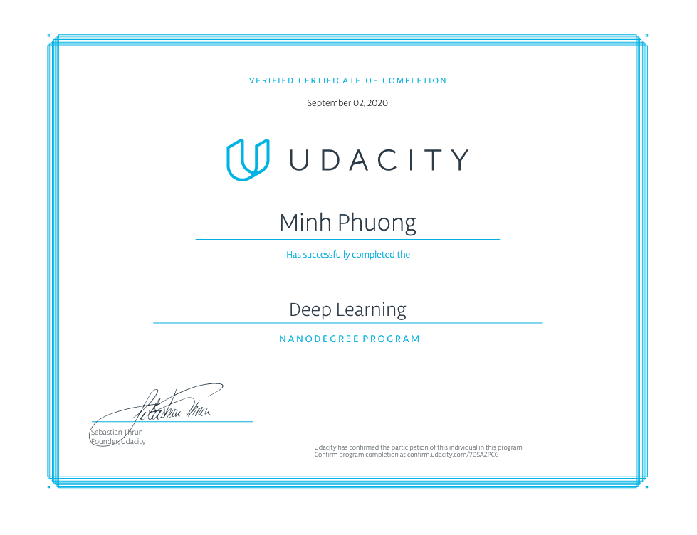
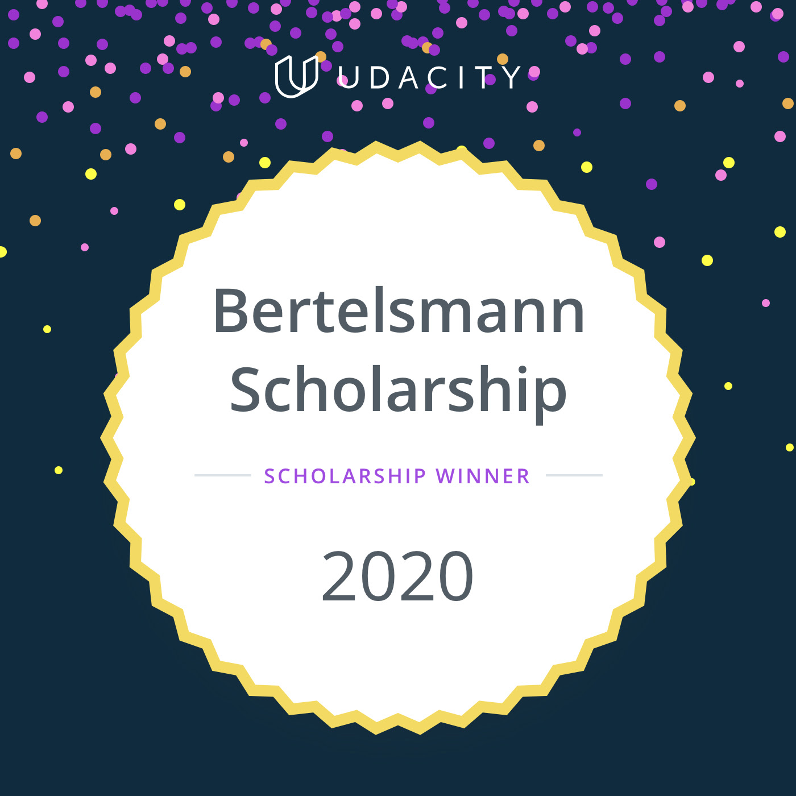

# Udacity Deep Learning Nanodegree
----

This is the repository for all my projects that I did during the the Udacity Deep Learning Nanodegree. I was also one of the Bertelmann's scholarship recipients in 2020. 

### Program outline:
**Project 1**: Predicting Bike-Sharing Patterns (build and train neural network from scratch)
**Project 2**: Dog Breed Classifier (convolutional neural network)
**Project 3**: Generate TV Scripts (recurrent neural network)
**Project 4**: Generate Faces (generative adversarial network)
**Project 5**: Deploying a Sentiment Analysis Model (using SageMaker)
**Project 6**: Teaching a Quadcopter To Fly (Reinforcement Learning)

 **Nanodegree Link:**
> https://www.udacity.com/course/deep-learning-nanodegree--nd101
> https://confirm.udacity.com/7DSAZPCG

## Deep Learning Nanodegree Certificate

